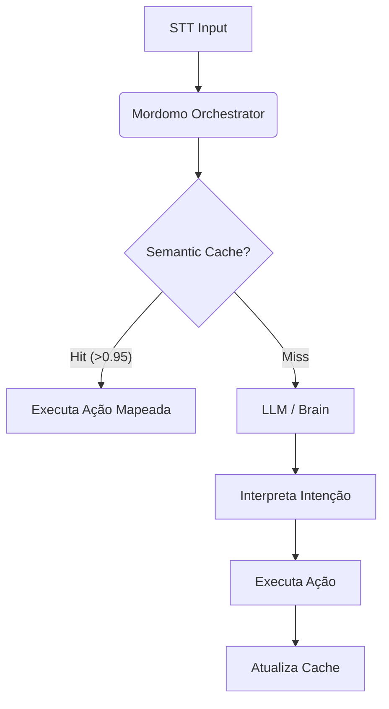

# Mordomo Orchestrator

## 🎯 Visão Geral
O **Mordomo Orchestrator** unifica a execução física do sistema para otimizar recursos no Orange Pi 5, mas mantém a **separação lógica** de responsabilidades em dois módulos internos distintos:

1.  **Session Controller (antigo Conversation Manager)**: Gerencia a "forma" da interação (estado da voz, turn-taking, interrupções).
2.  **System Core (antigo Core API)**: Gerencia o "conteúdo" (LLM, ferramentas, banco de dados, integrações).

## 🚀 Módulos Internos

### 1. Session Controller (Gerente de Sessão)
Responsável pela fluidez da interação de voz.
-   **Máquina de Estados**: Controla se o robô está `OUVINDO`, `PENSANDO` ou `FALANDO`.
-   **Gestão de Interrupção**: Se o usuário falar enquanto o robô fala, este módulo envia o sinal de `STOP` para o TTS imediatamente.
-   **Identificação**: Mantém o `speaker_id` ativo na sessão.

### 2. System Core (Cérebro Executivo)
Responsável pela inteligência e execução.
-   **Semantic Cache**: Intercepta inputs antes do LLM para comandos frequentes.
-   **LLM Gateway (LiteLLM)**: Gerencia chamadas para modelos de IA.
    -   **Estratégia**: API First (OpenAI/Anthropic/Groq) -> Fallback Local.
    -   **Modelo Local**: `qwen2.5:1.5b` (Leve e rápido para fallback).
-   **Action Dispatcher**: Sistema universal de roteamento para módulos externos.
-   **Skills Client**: Interface para delegar execução de código Python.
    -   **Nível 1 (Tático):** Envia scripts rápidos para o `skills-runner` (ex: cotação, cálculos).
    -   **Nível 2 (Estratégico):** Envia intenções complexas para o Módulo RPA (ex: projetos de scraping).
-   **Event System**: Processa notificações assíncronas dos módulos com fila de prioridade.
-   **Event Memory**: Armazena histórico de eventos para consultas contextuais do LLM.
    -   Permite perguntas como: _"Quem me mandou mensagem há 10 minutos?"_
    -   _"Sobre o que estávamos falando quanto aos RPAs?"_
-   **API REST**: Serve o Dashboard e Apps externos.

## 🔄 Dois Fluxos de Comunicação

### A. Request-Reply (Mordomo → Módulos)
**Fluxo iniciado pelo usuário ou LLM.**
```
Usuário: "Ligar luz da sala"
  ↓
LLM interpreta → {"module": "iot", "action": "turn_on", "params": {"device": "luz_sala"}}
  ↓
Action Dispatcher consulta Consul → Valida ação → Publica NATS (iot.command)
  ↓
Módulo IoT executa → Responde via NATS (iot.response)
  ↓
Dispatcher retorna resultado → TTS: "Luz da sala ligada"
```

### B. Event-Driven (Módulos → Mordomo)
**Fluxo iniciado por eventos externos.**
```
Câmera detecta intruso
  ↓
Módulo Security publica evento → security.event.intrusion_detected (priority=CRITICAL)
  ↓
Event Queue enfileira com prioridade máxima
  ↓
Event Handler executa automaticamente:
  1. Liga todas as luzes (via Action Dispatcher)
  2. Toca sirene
  3. Envia notificação push
  4. TTS: "Intruso detectado!"
```

## 🧠 Arquitetura do Semantic Cache

O Semantic Cache é um módulo interno projetado para "curto-circuitar" o fluxo de processamento, evitando chamadas caras e lentas ao LLM para comandos triviais.

### Fluxo de Processamento


### Stack Tecnológica do Cache
-   **Modelo de Embeddings**: `all-MiniLM-L6-v2` (Quantizado INT8).
    -   Tamanho: ~20MB.
    -   Velocidade: < 10ms em CPU (Orange Pi 5).
-   **Vector Store**: FAISS (Facebook AI Similarity Search) em modo in-memory ou Qdrant (modo embedded).
-   **Persistência**: SQLite (para mapeamento Vector ID -> Ação JSON).

## 🔐 Sistema de Permissões e Segurança (Herdado)

O Orchestrator implementa o sistema de permissões hierárquico anteriormente definido no Conversation Manager.

### Níveis de Acesso
- **Nível 0 (Público)**: Clima, Música, Perguntas Gerais.
- **Nível 3 (Residente)**: Iluminação (cômodo atual).
- **Nível 5 (Família)**: Termostatos, Câmeras (visualização).
- **Nível 8 (Admin/Pais)**: Alarmes, Automações, Fechaduras.
- **Nível 10 (Root)**: Scripts, Gestão de Usuários, Configuração do Sistema.

### Fluxo de Verificação
1.  **Identificação**: O `speaker_id` vem do módulo de Diarização.
2.  **Verificação de Sessão**: Se a sessão foi iniciada por um Admin, mas uma voz desconhecida ou de nível inferior tenta um comando crítico, o sistema bloqueia (Prevenção de Escalação de Privilégio).
3.  **Validação de Módulo**: Verifica se o usuário tem nível suficiente para o módulo solicitado (ex: `lights`, `alarm`).

## 🗄️ Modelo de Dados Unificado (PostgreSQL)

O schema do banco de dados unifica as necessidades de sessão e histórico.

```prisma
model User {
  user_id         String    @id @db.VarChar(50)
  name            String    @db.VarChar(100)
  level           Int       @default(0)
  is_guest        Boolean   @default(false)
  allowed_modules String[]  // Para convidados restritos
  conversations   Conversation[]
  action_logs     ActionLog[]
}

model Conversation {
  id         String    @id @default(uuid())
  speaker_id String    @db.VarChar(50)
  started_at DateTime  @default(now())
  status     Status    @default(ACTIVE) // ACTIVE, COMPLETED, INTERRUPTED
  messages   Message[]
}

model Message {
  id              String   @id @default(uuid())
  conversation_id String
  role            Role     // USER, ASSISTANT, SYSTEM
  content         String   @db.Text
  timestamp       DateTime @default(now())
}

model ActionLog {
  id            Int      @id @default(autoincrement())
  user_id       String
  action        String
  allowed       Boolean
  denial_reason String?
  timestamp     DateTime @default(now())
}
```

## 🔌 Interfaces e API

### NATS Topics (Event Driven)
-   `mordomo.speech.transcribed`: Entrada de texto do STT.
-   `mordomo.brain.process_request`: (Interno) Solicita processamento LLM.
-   `mordomo.tts.generate_request`: Saída para síntese de voz.
-   `iot.command.*`: Comandos para dispositivos.

### REST API (Dashboard)
-   `GET /api/v1/conversations`: Histórico de conversas.
-   `POST /api/v1/users`: Gestão de usuários.
-   `GET /api/v1/status`: Saúde do sistema.

## 🛠️ Stack Técnica do Container

-   **Linguagem**: Python 3.11+ (FastAPI).
-   **Servidor**: Uvicorn (com `uvloop` para performance).
-   **Comunicação**: `nats-py` (Cliente NATS assíncrono).
-   **Banco de Dados**: Conexão direta com PostgreSQL (TimescaleDB) para logs e Qdrant para vetores.

## 📊 Estimativa de Recursos

| Componente | RAM Estimada | CPU (Média) |
| :--- | :--- | :--- |
| Core (FastAPI + Logic) | 120MB | 5% |
| Semantic Cache (Model + Index) | 150MB | 10% (pico) |
| Action Dispatcher + Event Queue | 50MB | 3% |
| NATS & DB Connectors | 30MB | 2% |
| **TOTAL** | **~350MB** | **~20%** |

> **Comparativo**: A solução anterior (`conversation-manager` + `mordomo-core-api`) consumia ~500MB combinados. A unificação economiza ~150MB de RAM e reduz latência de comunicação interna.

## 📝 Estrutura de Pastas

```
mordomo-orchestrator/
├── src/
│   ├── api/                          # Endpoints REST/WebSocket
│   ├── core/
│   │   ├── cache/
│   │   │   └── semantic_cache.py     # Cache vetorial (FAISS)
│   │   ├── context/                  # Gerenciador de Contexto de Conversa
│   │   ├── dispatcher/
│   │   │   ├── service_discovery.py  # Integração Consul
│   │   │   ├── action_dispatcher.py  # Request-Reply pattern
│   │   │   └── README.md
│   │   ├── events/
│   │   │   ├── event_queue.py        # Fila de prioridade
│   │   │   ├── event_memory.py       # ✨ NOVO: Armazena eventos para consultas LLM
│   │   │   ├── handlers.py           # Políticas de reação a eventos
│   │   │   ├── README.md
│   │   │   └── EVENT_MEMORY.md       # ✨ Documentação completa
│   │   └── llm/
│   │       └── service.py            # LiteLLM (Cloud + Fallback)
│   ├── models/                       # Pydantic Models
│   └── services/                     # Serviços auxiliares
├── config/
├── tests/
├── Dockerfile
├── requirements.txt
└── main.py
```

## 🧠 Event Memory - Consultas Contextuais

### Propósito
Permite que o usuário faça perguntas sobre eventos recentes, como:
- _"Quem me mandou mensagem no WhatsApp há 10 minutos?"_
- _"Sobre o que estávamos falando quanto aos RPAs?"_
- _"Qual foi a última encomenda entregue?"_

### Como Funciona
1. **Armazenamento Automático**: Todos os eventos processados são salvos na Event Memory com metadados completos
2. **Indexação Múltipla**: Eventos indexados por módulo, tipo e timestamp para busca rápida
3. **API REST**: LLM consulta via `/api/events/context?query=...` para obter contexto
4. **Contexto Formatado**: Event Memory retorna texto estruturado pronto para injetar no prompt do LLM

### Exemplo de Fluxo
```
Usuário: "Aslam, quem me mandou mensagem há 10 minutos?"
  ↓
STT → Orchestrator → LLM detecta query sobre evento passado
  ↓
LLM: GET /api/events/context?query=quem me mandou mensagem há 10 minutos
  ↓
Event Memory retorna:
  "1. [15:30] mensagens.message_received
   De: João Silva (whatsapp)
   Mensagem: Confirma reunião amanhã?"
  ↓
LLM responde: "Foi o João Silva, ele perguntou sobre a reunião de amanhã"
  ↓
TTS: Síntese de voz
```

### API Endpoints
```http
# Eventos recentes (filtro flexível)
GET /api/events/recent?minutes=30&module=mensagens

# Contexto formatado para LLM
GET /api/events/context?query=quem me mandou mensagem há 10 minutos

# Estatísticas
GET /api/events/stats
```

### Estrutura de Evento Armazenado
```json
{
  "timestamp": "2025-12-04T15:30:00Z",
  "module": "mensagens",
  "event_type": "message_received",
  "priority": "HIGH",
  "data": {
    "sender": "João Silva",
    "platform": "whatsapp",
    "preview": "Confirma reunião amanhã?"
  },
  "handler_response": "Avisei sobre mensagem de João Silva"
}
```

### Configuração
- **Capacidade**: 500 eventos (FIFO circular)
- **Retenção**: 24 horas (cleanup automático)
- **RAM**: ~5-10MB (500 eventos)
- **Latência**: <5ms para consultas típicas

📖 **Documentação completa**: [EVENT_MEMORY.md](src/core/events/EVENT_MEMORY.md)

---

## ✅ Status de Implementação

- ✅ **Action Dispatcher**: Sistema universal de roteamento com Service Discovery (Consul)
- ✅ **Event System**: Fila de prioridade para notificações assíncronas de módulos
- ✅ **Event Memory**: Armazena eventos recentes para consultas contextuais do LLM
- ✅ **Event Handlers**: Políticas automáticas (intruso, mensagens, temperatura, etc.)
- ✅ **LLM Service**: LiteLLM com fallback Cloud → Local (qwen2.5:1.5b)
- ✅ **Semantic Cache**: FAISS para bypass de LLM em comandos frequentes
- ⏳ **Session Controller**: Máquina de estados de conversação (a implementar)
- ⏳ **REST API**: Endpoints para Dashboard UI (parcialmente implementado)
- ⏳ **PostgreSQL Integration**: Persistência de conversas e logs (a implementar)

## 🔌 Integrações NATS

### Subscriptions (Escuta)
- `*.event.>`: Todos os eventos de módulos externos (wildcard)
- `*.response`: Respostas de comandos despachados
- `mordomo.speech.transcribed`: Texto do STT (a implementar)

### Publications (Publica)
- `{module}.command`: Comandos para módulos (via Action Dispatcher)
- `tts.generate_request`: Solicitação de síntese de voz (a implementar)
- `system.orchestrator.status`: Heartbeat e status (a implementar)
